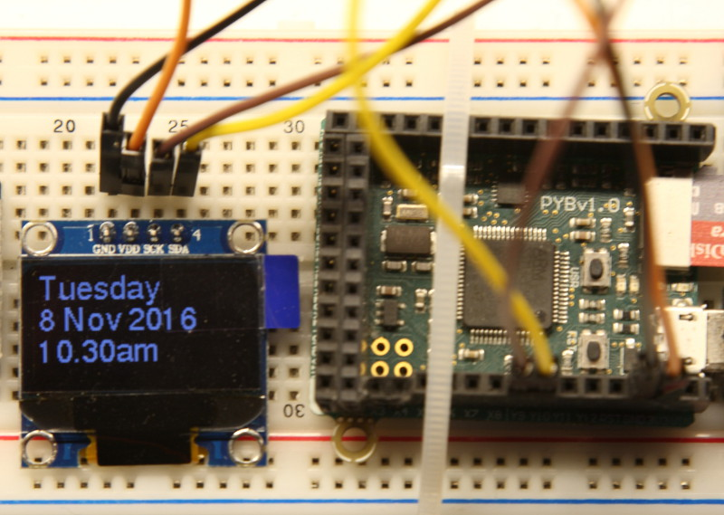

# ssd1306: Introduction

The official SSD1306 OLED display driver supports a single 8x8 pixel monospaced
font. Users of the 128x64 displays in particular may wish to use larger fonts.
This provides a means of extending the official driver to support this. Suitable
font files may be created from standard ``ttf`` or ``otf`` files using the utility
presented [here](https://github.com/peterhinch/micropython-font-to-py.git).




# Files

1. ssd1306_test.py A simple test program.
2. ssd1306.py A snapshot of the current official driver.
3. ssd1306_drv.py A temporary Python fix for a bug in the above.
4. writer.py A generic Writer class. Keeps track of the text insertion point
over multiple fonts, handles newline and vertical scrolling if required.

In addition several font files are provided as samples.

# Getting started

Edit ``ssd1306_test.py`` to match your hardware, namely whether it uses SPI or
I2C and the value of HEIGHT. The file contains details of how to wire the device
to a Pyboard. It is untested on other platforms, but I'd expect it to be
portable to any device supporting the official driver. If in doubt, install and
test this first.

Copy files 1-4 and ``freesans20.py`` to the target and issue

```python
import ssd1306_test
```

# Principle of Operation

Font files are converted to Python modules for ease of use and also (optionally)
to enable the modules to be frozen as bytecode to reduce RAM requirements.

The user program should import all fonts which are to be used and declare a
``Writer`` instance for each one. Rendering text at the current insertion point
is then simply a matter of issuing the appropriate writer's ``printstring``
method. After issuing all such calls required by your application the display
should be updated by issuing

```python
ssd.show()
```

# The Writer class

The principal interaction with the driver is via this class. One instance should
be created for each font in use. Its function is to keep track of the text
insertion point over successive uses with multiple fonts and to handle newline
characters and vertical scrolling. Its behaviour when text overruns the end of
a line or the bottom of the screen may be controlled using its ``set_clip``
method.

## Methods

1. ``Constructor`` This takes the ``ssd`` display instance and the font module
as mandatory args.
2. ``printstring`` Takes a text string as argument and renders it at the current
insertion point. Respects newline characters.

## Class methods

1. ``set_textpos`` Mandatory integer args ``row``, ``col`` defined in pixels
relative to the top left hand corner of the display. Sets the current text
insertion point. The coordinates of a glyph refer to its top left corner. The
initial default is (0,0) with text being rendered at the top left of the display.
2. ``set_clip`` Mandatory boolean args ``row_clip``, ``col_clip``. These define
behaviour when text overruns the physical width or height of the display. By
default text overrunning the display width will continue on the next row. Setting
``col_clip`` overrides this such that overrunning text is lost. Similarly, by
default text overrunning the bottom of the display will cause text above to
scroll up to accommodate it. Setting ``row_clip`` will override this behaviour
causing text to be clipped.

A final classmethod is provided for possible future use.

``mapping`` The current official ssd1306 driver configures the hardware to use
an unorthodox mapping of bytes onto pixels. The original plan for the
``framebuf`` module was that it should support vertical and horizontal mappings
only. Should the official ssd1306 driver be changed to use vertical mapping
(which the device supports) this method may be used to accommodate it. This mode
has been tested.

# Note

The official SSD1306 driver is based on the framebuf module which is in a state
of active development. The code presented here extends the official driver and
consequently may be less than stable if there is significant change to the
underlying framebuffer class. Further, the official driver's scroll method is
buggy and at the time of writing there is a moratorium on PR's. I have coded a
Python workround in the file ssd1306_drv.py. Hopefully in time this file will
become redundant and the official driver will support vertical scrolling over
long distances.

# License

Any code placed here is released under the MIT License (MIT).  
The MIT License (MIT)  
Copyright (c) 2016 Peter Hinch  
Permission is hereby granted, free of charge, to any person obtaining a copy
of this software and associated documentation files (the "Software"), to deal
in the Software without restriction, including without limitation the rights
to use, copy, modify, merge, publish, distribute, sublicense, and/or sell
copies of the Software, and to permit persons to whom the Software is
furnished to do so, subject to the following conditions:
The above copyright notice and this permission notice shall be included in
all copies or substantial portions of the Software.
THE SOFTWARE IS PROVIDED "AS IS", WITHOUT WARRANTY OF ANY KIND, EXPRESS OR
IMPLIED, INCLUDING BUT NOT LIMITED TO THE WARRANTIES OF MERCHANTABILITY,
FITNESS FOR A PARTICULAR PURPOSE AND NONINFRINGEMENT. IN NO EVENT SHALL THE
AUTHORS OR COPYRIGHT HOLDERS BE LIABLE FOR ANY CLAIM, DAMAGES OR OTHER
LIABILITY, WHETHER IN AN ACTION OF CONTRACT, TORT OR OTHERWISE, ARISING FROM,
OUT OF OR IN CONNECTION WITH THE SOFTWARE OR THE USE OR OTHER DEALINGS IN
THE SOFTWARE.
