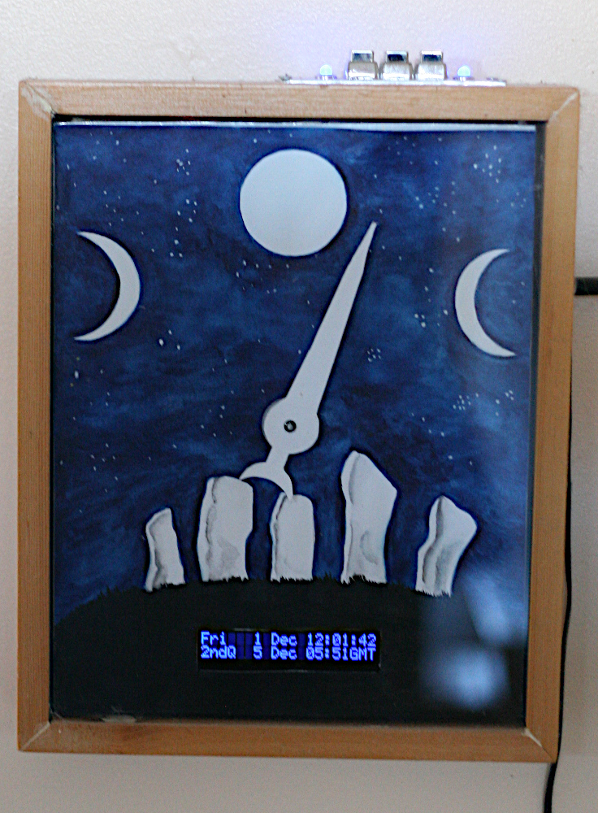

# Astronomical calculations in MicroPython

This module enables sun and moon rise and set times to be determined at any
geographical location. Times are in seconds from midnight and refer to any
event in a 24 hour period starting at midnight. The midnight datum is defined in
local time. The start is a day being the current day plus an offset in days.

A `moonphase` function is also provided enabling the moon phase to be determined
for any date.


Caveat. I am not an astronomer. If there are errors in the fundamental
algorithms I am unlikely to be able to offer an opinion, still less a fix.

The code is currently under development: the API may change.

## Applications

There are two application areas. Firstly timing of events relative to sun or
moon rise and set times, discussed later in this doc. Secondly constructing
lunar clocks such as this one - the "lunartick":


## Licensing and acknowledgements

The code was ported from C/C++ as presented in "Astronomy on the Personal
Computer" by Montenbruck and Pfleger, with mathematical improvements contributed
by Raul Kompaß and Marcus Mendenhall. The sourcecode exists in the book and also
on an accompanying CD-R. The file `CDR_license.txt` contains a copy of the
license file on the disk, which contains source, executable code, and databases.
This module (obviously) only references the source. I am not a lawyer; I have no
idea of the legal status of code translated from sourcecode in a published work.

## Installation

Installation copies files from the `astronomy` directory to a directory
`\lib\sched` on the target. This is for optional use with the
[schedule module](https://github.com/peterhinch/micropython-async/blob/master/v3/docs/SCHEDULE.md).
This may be done with the official
[mpremote](https://docs.micropython.org/en/latest/reference/mpremote.html):
```bash
$ mpremote mip install "github:peterhinch/micropython-samples/astronomy"
```
On networked platforms it may alternatively be installed with
[mip](https://docs.micropython.org/en/latest/reference/packages.html).
```py
>>> mip.install("github:peterhinch/micropython-samples/astronomy")
```
Currently these tools install to `/lib` on the built-in Flash memory. To install
to a Pyboard's SD card [rshell](https://github.com/dhylands/rshell) may be used.
Move to `micropython-samples` on the PC, run `rshell` and issue:
```
> rsync astronomy /sd/sched
```
`mip` installs the following files in the `sched` directory.
* `sun_moon.py`
* `sun_moon_test.py` A test/demo script.
After installation the `RiSet` class may be accessed with
```python
from sched.sun_moon import RiSet
```

# The RiSet class

This holds the local geographic coordinates and the localtime offset relative to
UTC. It is initialised to the current date and can provide the times of rise and
set events occurring within a 24 hour window starting at 00:00:00 local time.
The `RiSet` instance's date may be changed allowing rise and set times to be
retrieved for other 24 hour windows.

Rise and set times may be retrieved in various formats including seconds from
local midnight: this may be used to enable the timing of actions relative to a
rise or set event.

## Constructor

Args (float):
* `lat=LAT` Latitude in degrees (-ve is South). Defaults are my location. :)
* `long=LONG` Longitude in degrees (-ve is West).
* `lto=0` Local time offset in hours to UTC (-ve is West).

Methods:
* `set_day(day: int = 0)` `day` is the offset in days from the current system
date. If `day` is changed compared to the object's currently stored value its
rise and set times are updated. Returns the `RiSet` instance.
* `sunrise(variant: int = 0)` See below for details and the `variant` arg.
* `sunset(variant: int = 0)`
* `moonrise(variant: int = 0)`
* `moonset(variant: int = 0)`
* `moonphase()` Return current phase as a float: 0.0 <= result < 1.0. 0.0 is new
moon, 0.5 is full.
* `set_lto(t)` Set localtime offset in hours relative to UTC. Primarily intended
for daylight saving time. Rise and set times are updated if the lto is changed.

The return value of the rise and set method is determined by the `variant` arg.
In all cases rise and set events are identified which occur in the current 24
hour period. Note that a given event may be absent in the period: this can occur
with the moon at most locations, and with the sun in polar regions.

Variants:
* 0 Return integer seconds since midnight local time (or `None` if no event).
* 1 Return integer seconds since since epoch of the MicroPython platform
 (or `None`).
* 2 Return text of form hh:mm:ss (or --:--:--) being local time.

Example constructor invocations:
```python
r = RiSet()  # UK near Manchester
r = RiSet(lat=47.609722, long=-122.3306, lto=-8)  # Seattle 47°36′35″N 122°19′59″W
r = RiSet(lat=-33.87667, long=151.21, lto=11)  # Sydney 33°52′04″S 151°12′36″E
```

# The moonphase function

This is a simple function whose provenance is uncertain. I have a lunar clock
which uses the original C code. This has run for 14 years without issue, but I
can't vouch for its absolute accuracy over long time intervals. The Montenbruck
and Pfleger version is very much more involved but they claim accuracy over
centuries.

Args:
* `year: int` 4-digit year
* `month: int` 1..12
* `day: int` Day of month 1..31
* `hour: int` 0..23

Return value:  
A float in range 0.0 <= result < 1.0, 0 being new moon, 0.5 being full moon.

# Utility functions

`now_days() -> int` Returns the current time as days since the platform epoch.
`abs_to_rel_days(days: int) -> int` Takes a number of days since the Unix epoch
(1970,1,1) and returns a number of days relative to the current date. Platform
independent. This facilitates testing with pre-determined target dates.

# Demo script

This produces output for the fixed date 4th Dec 2023 at three geographical
locations. It can therefore be run on platforms where the system time is wrong.
To run issue:
```python
import sched.sun_moon_test
```
Expected output:
```python
>>> import sched.sun_moon_test
4th Dec 2023: Seattle UTC-8
Sun rise 07:40:09 set 16:18:15
Moon rise 23:38:11 set 12:53:40

4th Dec 2023: Sydney UTC+11
Sun rise 05:36:24 set 19:53:21
Moon rise 00:45:55 set 11:27:14

From 4th Dec 2023: UK, UTC
Day: 0
Sun rise 08:04:34 set 15:52:13
Moon rise 23:03:15 set 13:01:04
Day: 1
Sun rise 08:05:54 set 15:51:42
Moon rise --:--:-- set 13:10:35
Day: 2
Sun rise 08:07:13 set 15:51:13
Moon rise 00:14:40 set 13:18:59
Day: 3
Sun rise 08:08:28 set 15:50:49
Moon rise 01:27:12 set 13:27:08
Day: 4
Sun rise 08:09:42 set 15:50:28
Moon rise 02:40:34 set 13:35:56
Day: 5
Sun rise 08:10:53 set 15:50:10
Moon rise 03:56:44 set 13:46:27
Day: 6
Sun rise 08:12:01 set 15:49:56
Moon rise 05:18:32 set 14:00:11
>>>
```
Code comments show times retrieved from `timeanddate.com`.

# Scheduling events

A likely use case is to enable events to be timed relative to sunrise and set.
In simple cases this can be done with `asyncio`.
```python
from sched.sun_moon import RiSet
import time
rs = RiSet()
tsecs = time.time()  # Time now in secs since epoch
tsecs -= tsecs % 86400  # Last midnight in secs since epoch
tmidnight = tsecs
async def do_sunrise():
    while True:
        toff = time.time() - tmidnight  # Seconds relative to midnight
        if toff > 0:  # Midnight has passed, wait for sunrise
            twait = rs.sunrise() - toff  # Assumes a latitude where sun must rise
        else:  # Wait for tomorrow
            twait = tmidnight + 86400 + toff
        await asyncio.sleep(twait)
        if toff > 0:
            # Turn the lights off, or whatever
```
An alternative, particularly suited to more complex cases, is to use the
[schedule module](https://github.com/peterhinch/micropython-async/blob/master/v3/docs/SCHEDULE.md).
This allows more intuitive coding without the epoch calculations. The following
is a minimal example:
```python
import uasyncio as asyncio
from sched.sched import schedule
from sched.sun_moon import RiSet

async def turn_off_lights(rs):  # Runs at 00:01:00
    rs.set_day()  # Re-calculate for new daylight
    asyncio.sleep(rs.sunrise() - 60)
    # Actually turn them off

async def main():
    rs = RiSet()  # May need args for your location
    await schedule(turn_off_lights, rs, hrs=0, mins=1)  # Never terminates

try:
    asyncio.run(main())
finally:
    _ = asyncio.new_event_loop()
```
This approach lends itself to additional triggers and events:
```python
import uasyncio as asyncio
from sched.sched import schedule, Sequence
from sched.sun_moon import RiSet

async def turn_off_lights(t):
    asyncio.sleep(t)
    # Actually turn them off

async def main():
    rs = RiSet()  # May need args for your location
    seq = Sequence()  # A Sequence comprises one or more schedule instances
    asyncio.create_task(schedule(seq, "off", hrs=0, mins=1))
    # Can schedule other events here
    async for args in seq:
        if args[0] == "off":  # Triggered at 00:01 hrs (there might be other triggers)
            rs.set_day()  # Re-calculate for new day
            asyncio.create_task(turn_off_lights(rs.sunrise() - 60))

try:
    asyncio.run(main())
finally:
    _ = asyncio.new_event_loop()
```
