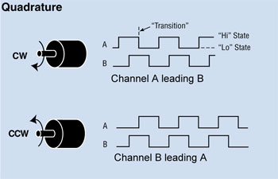
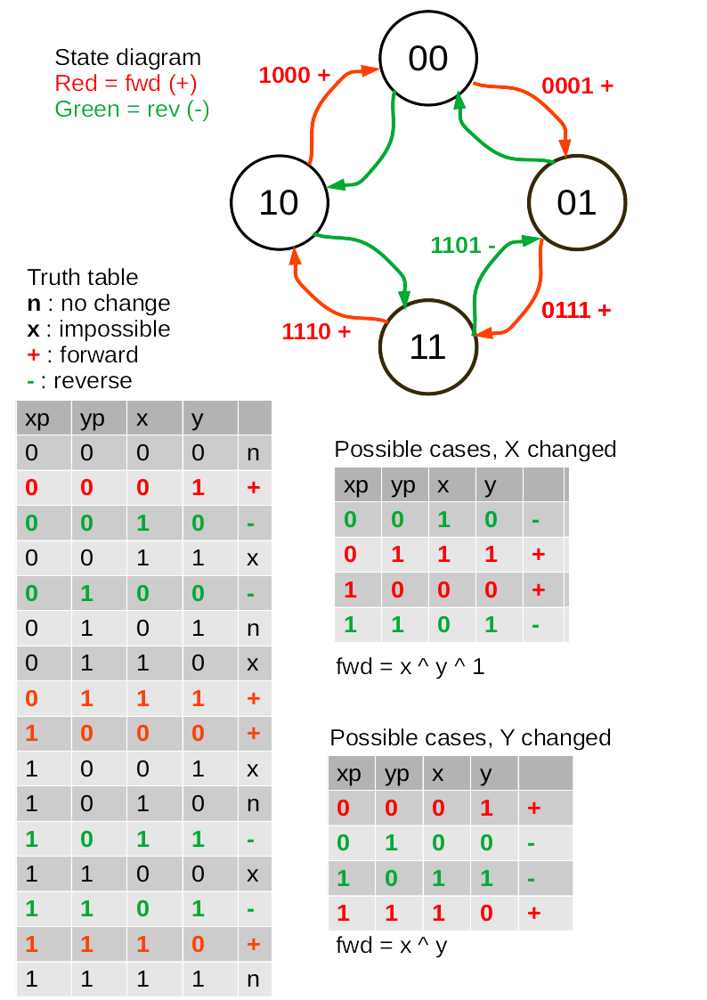

# 1. Incremental encoders

There are three technologies that I am aware of:
 1. Optical.
 2. Magnetic.
 3. Mechanical (using switch contacts).

All produce quadrature signals looking like this:  
  
consequently the same code may be used regardless of encoder type.

They have two primary applications:
 1. Shaft position and speed measurements on machines.
 2. Control knobs for user input. For user input a mechanical device, being
 inexpensive, usually suffices. See [this Adafruit product](https://www.adafruit.com/product/377).

In applications such as NC machines longevity and reliability are paramount:
this normally rules out mechanical devices. Rotational speed is also likely to
be too high. In machine tools it is vital to maintain perfect accuracy over
very long periods. This may impact the electronic design of the interface
between the encoder and the host. High precision comes at no cost in code, but
there may be issues in devices with high interrupt latency such as ESP32,
especially with SPIRAM.

The ideal host, especially for precison applications, is a Pyboard. This is
because Pyboard timers can decode in hardware, as shown 
[in this script](https://github.com/dhylands/upy-examples/blob/master/encoder.py)
from Dave Hylands. Hardware decoding eliminates all concerns over interrupt
latency or input pulse rates.

# 2. Basic encoder script

This comes from `encoder_portable.py` in this repo. It uses the simplest and
fastest algorithm I know. It should run on any MicroPython platform, but please
read the following notes as there are potential issues.

```python
from machine import Pin

class Encoder:
    def __init__(self, pin_x, pin_y, scale=1):
        self.scale = scale
        self.pin_x = pin_x
        self.pin_y = pin_y
        self._pos = 0
        try:
            self.x_interrupt = pin_x.irq(trigger=Pin.IRQ_RISING | Pin.IRQ_FALLING, handler=self.x_callback, hard=True)
            self.y_interrupt = pin_y.irq(trigger=Pin.IRQ_RISING | Pin.IRQ_FALLING, handler=self.y_callback, hard=True)
        except TypeError:
            self.x_interrupt = pin_x.irq(trigger=Pin.IRQ_RISING | Pin.IRQ_FALLING, handler=self.x_callback)
            self.y_interrupt = pin_y.irq(trigger=Pin.IRQ_RISING | Pin.IRQ_FALLING, handler=self.y_callback)

    def x_callback(self, pin_x):
        forward = pin_x() ^ self.pin_y()
        self._pos += 1 if forward else -1

    def y_callback(self, pin_y):
        forward = self.pin_x() ^ pin_y() ^ 1
        self._pos += 1 if forward else -1

    def position(self, value=None):
        if value is not None:
            self._pos = round(value / self.scale)
        return self._pos * self.scale
```
If the direction is incorrect, transpose the X and Y pins in the constructor
call.

# 3. Problem 1: Interrupt latency

By default, pin interrupts defined using the `machine` module are soft. This
introduces latency if a line changes state when a garbage collection is in
progress. The above script attempts to use hard IRQ's, but not all platforms
support them (notably ESP8266 and ESP32).

Hard IRQ's present their own issues documented
[here](https://docs.micropython.org/en/latest/reference/isr_rules.html) but
the above script conforms with these rules.

# 4. Problem 2: Jitter

The picture above is idealised. In practice it is possible to receive a
succession of edges on one input line, with no transitions on the other. On
mechanical encoders this may be caused by
[contact bounce](http://www.ganssle.com/debouncing.htm). On any type it can
result from vibration, where the encoder happens to stop at an angle exactly
matching an edge. An arbitrarily long sequence of pulses on one line is the
result. A correct algorithm must be able to cope with this: the outcome will be
one digit of jitter in the output count but no systematic drift.

Contrary to common opinion a state table is not necessary to produce a correct
algorithm: see [section 7](./ENCODERS.md#7-algorithm).

In practice the frequency of such edges may be arbitrarily high. This imposes
a need for synchronisation.

## 4.1 Synchronisation

Decoders of all types (including hardware implementations) can fail if edges on
one line occur at too high a rate: transitions can be missed leading to a
gradual drift of measured count compared to actual position. With an encoder
that produces good logic levels the solution is to limit the rate by
pre-synchronising the digital signals to a clock. For bit-perfect results a
single level of clock synchronisation is inadequate because of metastability.
Typically two levels are used. See
[this Wikipedia article](url=https://en.wikipedia.org/wiki/Incremental_encoder#Clock_synchronization).

The clock rate of a synchroniser for a software decoder must be chosen with
regard to the worst-case latency of the host. The clock rate will then
determine the maximum permissible rotation speed of the encoder.

Contact bounce on mechanical encoders can also result in invalid logic levels.
This can cause a variety of unwanted results: conditioning with a CR network
and a Schmitt trigger should be considered.

In practice bit-perfect results are often not required and simple software
solutions are fine. In particular encoders used for user controls normally have
some form of user feedback. The occasional missed pulse caused by fast contact
bounce will not be noticed.

Where bit-perfect results are required the simplest approach is to use a target
which supports hardware decoding and which pre-synchronises the signals. STM32
meets these criteria.

# 5. Problem 3: Concurrency

The presented code samples use interrupts in order to handle the potentially
high rate at which transitions can occur. The above script maintains a
position value `._pos` which can be queried at any time. This does not present
concurrency issues because changes to an integer are atomic.

However some applications, notably in user interface designs, may require an
encoder action to trigger complex behaviour. The obvious solution would be to
adapt the script to do this by having the two ISR methods call a function. 
However the function would run in an interrupt context which (even with soft
IRQ's) presents concurrency issues where an application's data can change at
any point in the application's execution. Further, a complex function would
cause the ISR to block for a long period which is bad practice.

A solution to this is an interface between the ISR's and `uasyncio` whereby the
ISR's set a `ThreadSafeFlag`. This is awaited by a `uasyncio` `Task` which runs
a user supplied callback. The latter runs in a `uasyncio` context: the state of
any `Task` can only change at times when it has yielded to the scheduler in
accordance with `uasyncio` rules. This is implemented in
[this asynchronous driver](https://github.com/peterhinch/micropython-async/blob/master/v3/docs/DRIVERS.md#6-quadrature-encoders).
This also handles the case where a mechanical encoder has a large number of
states per revolution. The driver has the option to divide these down, reducing
the rate at which callbacks occur.

# 6. Code samples

 1. `encoder_portable.py` Suitable for most purposes.
 2. `encoder_timed.py` Provides rate information by timing successive edges. In
 practice this is likely to need filtering to reduce jitter caused by
 imperfections in the encoder geometry. With a mechanical knob turned by an
 anthropoid ape it's debatable whether it produces anything useful :)
 3. `encoder_rp2.py` Version specific to Raspberry Pico RP2 chip. This uses the
 PIO and Viper code to achieve fast response - upto ~10K transitions/s.
 4. `encoder.py` An old Pyboard-specific version.

These were written for encoders producing logic outputs. For switches, adapt
the pull definition to provide a pull up or pull down as required, or provide
physical resistors. The latter is my preferred solution as the internal
resistors on most platforms have a rather high value posing a risk of slow
edges.

# 7. Algorithm

Discussions on the MicroPython forum demonstrate a degree of confusion about
the merits of different decoding algorithms and about contact debouncing. These
notes aim to clarify the issues and to provide an explanation for the approach
used in my code samples; also to describe the mechanism where errors occur.

Incremental encoders produce two signals `x` and `y`. Possible state changes
are shown in this state diagram.  

  

The truth table includes the previous (`xp` and `yp`) and current (`x` and `y`)
values of the signals. It includes all logically possible combinations of these
signals. These include cases where no change occurs (marked `n`) and cases
which are physically impossible (`x`). The latter arise because both signals
cannot change state simultaneously.

Decoding these four bits is a problem of combinatorial logic. All such problems
may be solved by using the bits as addresses of a lookup table. In this case
there would be two output bits signifying increment, decrement or do nothing.
However, simplifications are possible if changes of `x` and `y` trigger
interrupts.

The truth table may then be split into two, one catering for cases where `x`
has changed, and the other for `y` changes. The illegal cases are discarded and
the "no change" cases will not trigger an interrupt. All cases in these tables
cause a change in position and inspection shows that the direction is the
`exclusive or` of the current `x` and `y` values, with opposite polarity for
the `x` and `y` interrupts.

## 7.1 Debouncing

Contact bounce or vibration effects cause an oscillating signal on one line.
The state diagram shows that this is logically indistinguishable from a
physical movement of the encoder backwards and forwards across one transition
point. Consequently any valid decoding algorithm will register a change in
position of one LSB forwards and backwards. There is no systematic drift, just
one LSB of positional uncertainty.

## 7.2 Algorithm quality

All valid solutions to a combinatorial logic problem are equivalent. The only
ways in which one solution can be considered "better" than another are in
qualities such as performance and code size.

## 7.3 Interrupt issues

As discussed above, any solution will have a limit to the rate at which edges
can be tracked. This section describes the limits of a MicroPython
interrupt-driven solution and the way in which incorrect counts can arise.

Interrupts suffer from latency: there is a time delay between an edge occurring
and the ISR executing. The magnitude depends on what is running at the moment
the edge occurs and consequently varies in real time. Another ISR may be
running. Higher priority interrupts may be pending service. In the case of soft
IRQ's garbage collection may be in progress.

Consider the following ISR:
```python
    def x_callback(self, pin_x):
        forward = pin_x() ^ self.pin_y()
        self._pos += 1 if forward else -1
```
This is necessarily triggered by either edge on `pin_x`. While `.pin_y` should
be stable when an edge occurs on `pin_x`, the state of `pin_x` may have changed
by the time the latency has elapsed and the ISR reads its value. In this case
the change will be registered with the wrong direction.

Further, this second pin change will trigger another interrupt. The consequence
of this depends on hardware and firmware implementations. The interrupt may be
missed, it may execute after the first has completed, or re-entrancy may take
place. However, by this time an error has already occurred as described above.
There is nothing to gain by trying to fix this (e.g. by disabling interrupts in
the ISR).

In a careful test of a software decoder on a Pyboard 1.1 with an optical
encoder pulses were occasionally missed. This confirms that, even with clean
logic levels and hard IRQ's, on rare occasions pulses arrive too fast for the
ISR to track.

If bit-perfect results are required, hardware rate limiting must be applied.
