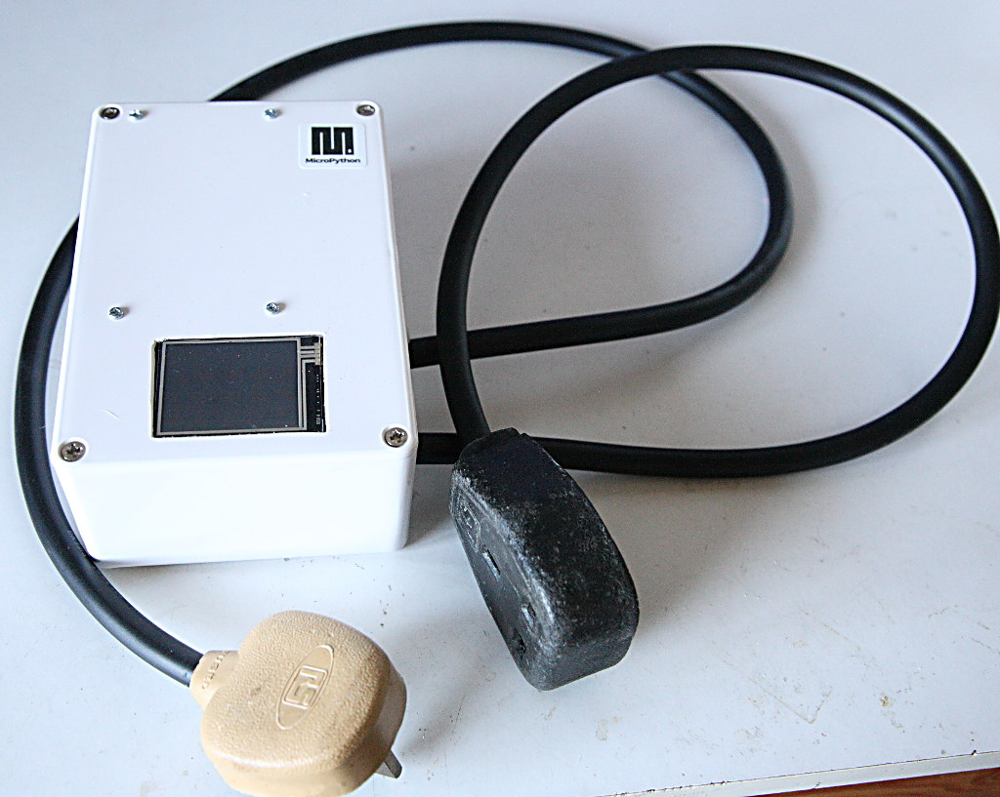
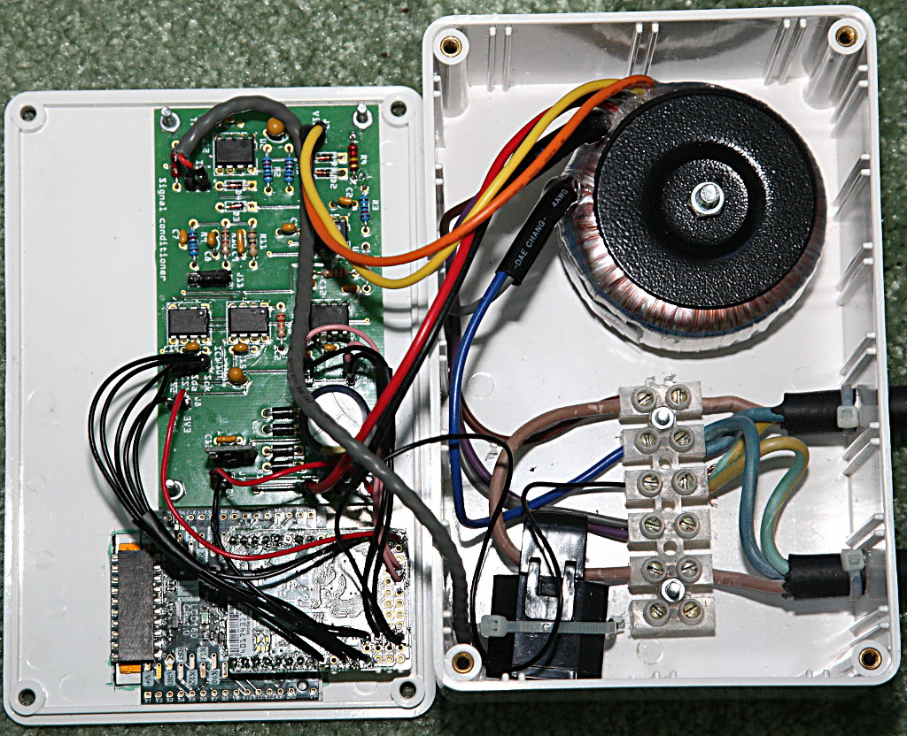
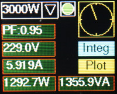
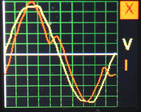
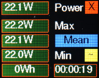
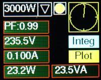
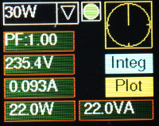

# Power Meter Sample Images

Interior construction - slightly out of date: doesn't show cable glands.

## Screenshots.

**These look much better in reality than in my pictures.**

Microwave oven.

Microwave waveforms.

Integration screen.

Soldering iron on 3KW range.

Same iron on 30W range.

